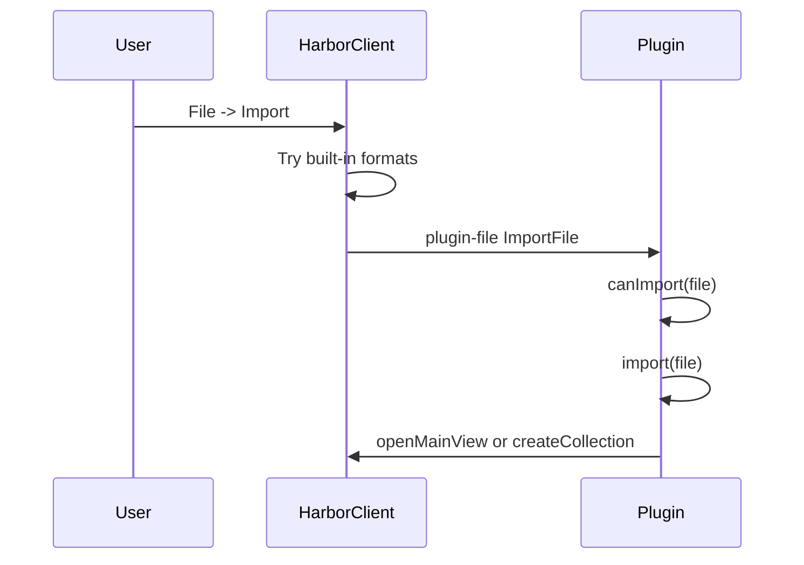

# Import handler

This example is a **renderer plugin** that registers a **File → Import** handler for a custom `.json` request-bundle format. Users choose **File → Import** in HarborClient, pick a bundle file, preview the requests in a main view, and create a collection with `hc.host.createCollection`.

Use import handlers when your plugin adds a new import format. Do **not** add a separate **File** menu item — register with `hc.imports.registerHandler` or the `registerImportHandler` helper instead. Built-in formats (Postman, Bruno, HAR, and HarborClient exports) are detected first; your handler runs only when the file is unrecognized and its extension matches.



For a production OpenAPI importer with YAML support and operation selection, see [harborclient/plugin-openapi](https://github.com/harborclient/plugin-openapi).

## Bundle format

Example file the handler recognizes:

```json
{
  "bundleFormat": "request-bundle",
  "version": 1,
  "name": "Example API",
  "requests": [
    { "name": "List items", "method": "GET", "url": "https://api.example.com/items" },
    { "name": "Create item", "method": "POST", "url": "https://api.example.com/items" }
  ]
}
```

## manifest.json

```json
{
  "id": "com.example.request-bundle",
  "name": "Request Bundle Import",
  "version": "1.0.0",
  "categories": ["import"],
  "engines": { "harborclient": ">=1.9.0" },
  "renderer": "dist/renderer.js",
  "permissions": ["ui"],
  "contributes": {
    "mainViews": [{ "id": "bundle.import", "title": "Import Request Bundle" }]
  }
}
```

Import handlers are registered at runtime — no `contributes.menus` or `contributes.commands` entry is required for **File → Import**.

## src/importSession.ts

Stash the selected file so the preview main view can read it on mount:

```typescript
import type { ImportFile } from '@harborclient/sdk';

let pendingImport: ImportFile | null = null;

export function setPendingImport(file: ImportFile): void {
  pendingImport = file;
}

export function consumePendingImport(): ImportFile | null {
  const file = pendingImport;
  pendingImport = null;
  return file;
}
```

## src/renderer.tsx

```tsx
import { installReact, registerImportHandler } from '@harborclient/sdk';
import type { PluginContext } from '@harborclient/sdk';
import { ImportPreview } from './ImportPreview';
import { setPendingImport } from './importSession';

const MAIN_VIEW_ID = 'bundle.import';

interface RequestBundle {
  bundleFormat: 'request-bundle';
  version: 1;
  name: string;
  requests: Array<{ name: string; method: string; url: string }>;
}

/**
 * Returns whether raw JSON looks like a request bundle this plugin owns.
 */
function canImportRequestBundle(contents: string): boolean {
  try {
    const parsed = JSON.parse(contents) as Partial<RequestBundle>;
    return parsed.bundleFormat === 'request-bundle' && parsed.version === 1;
  } catch {
    return false;
  }
}

export function activate(hc: PluginContext): void {
  installReact(hc.react);

  function ImportPreviewHost() {
    return <ImportPreview hc={hc} />;
  }

  hc.ui.registerMainView({
    id: MAIN_VIEW_ID,
    title: 'Import Request Bundle',
    Component: ImportPreviewHost
  });

  registerImportHandler(hc, '.json', {
    canImport: (file) => canImportRequestBundle(file.contents),
    import: async (file) => {
      setPendingImport(file);
      await hc.commands.execute('harborclient:openMainView', hc.pluginId, MAIN_VIEW_ID);
    }
  });
}
```

## src/ImportPreview.tsx

```tsx
import type { PluginContext } from '@harborclient/sdk';
import { Button } from '@harborclient/sdk/components';
import { useEffect, useState } from '@harborclient/sdk/react';
import { consumePendingImport } from './importSession';

interface Props {
  hc: PluginContext;
}

export function ImportPreview({ hc }: Props) {
  const [bundleName, setBundleName] = useState('');
  const [requests, setRequests] = useState<Array<{ name: string; method: string; url: string }>>(
    []
  );
  const [importing, setImporting] = useState(false);

  useEffect(() => {
    const file = consumePendingImport();
    if (!file) {
      return;
    }

    const parsed = JSON.parse(file.contents) as {
      name: string;
      requests: Array<{ name: string; method: string; url: string }>;
    };
    setBundleName(parsed.name);
    setRequests(parsed.requests);
  }, []);

  async function handleImport(): Promise<void> {
    setImporting(true);
    try {
      await hc.host.createCollection({
        name: bundleName,
        requests
      });
      hc.ui.showToast(`Imported ${requests.length} requests`);
    } finally {
      setImporting(false);
    }
  }

  return (
    <div>
      <h1>Import Request Bundle</h1>
      <p>
        {requests.length} requests ready to import into "{bundleName}".
      </p>
      <Button
        variant="primary"
        disabled={importing || requests.length === 0}
        onClick={handleImport}
      >
        {importing ? 'Importing…' : 'Import collection'}
      </Button>
    </div>
  );
}
```

## Direct import variant

When you do not need a preview step, create the collection inside `import`:

```typescript
registerImportHandler(hc, '.json', {
  canImport: (file) => canImportRequestBundle(file.contents),
  import: async (file) => {
    const bundle = JSON.parse(file.contents) as RequestBundle;
    await hc.host.createCollection({
      name: bundle.name,
      requests: bundle.requests
    });
    hc.ui.showToast(`Imported ${bundle.requests.length} requests`);
  }
});
```

## Tips

- **`canImport` must be cheap and conservative** — for `.json` files, parse once and check a discriminator field. Built-in importers already handle Postman collections and HarborClient exports; return `false` for those shapes.
- **Register every extension you support** — `['.json', '.yaml', '.yml']` adds all three to the import file picker.
- **Use `hc.host.createCollection`** for bulk collection creation. See [Themes and storage → hc.host](/renderer-data#hchostcreatecollectionpayload) for the payload shape.
