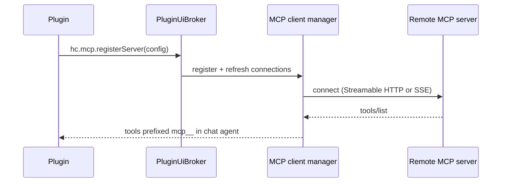

# MCP client server

This example is a **renderer plugin** that registers a remote MCP client server so Harbor's chat agent can discover and call tools from an external MCP endpoint over Streamable HTTP or legacy SSE.

Use `hc.mcp.registerServer` when your plugin integrates a hosted MCP service (for example WordPress, a team API gateway, or a SaaS MCP bridge). Registrations are **activation-scoped**: Harbor connects while the plugin is enabled and removes the server when you dispose the returned handle or the plugin unloads. Plugin-owned servers appear as **read-only** rows in **Settings → AI & MCP** with plugin attribution; they are not copied into user MCP settings.



See [hc.mcp](/renderer-data#hcmcp) for the full API reference and [Permissions](/permissions) for the `mcp` capability flag.

## manifest.json

```json
{
  "id": "com.example.wordpress-mcp",
  "name": "WordPress MCP",
  "version": "1.0.0",
  "summary": "Connect Harbor's chat agent to WordPress MCP tools.",
  "engines": { "harborclient": ">=2.3.0" },
  "renderer": "dist/renderer.js",
  "permissions": ["mcp"]
}
```

MCP client registration is runtime-only — no `contributes` entry is required. Declare the `mcp` permission so HarborClient shows it in the install confirmation dialog.

## src/renderer.tsx

```typescript
import type { PluginContext } from '@harborclient/sdk';

/**
 * Registers the WordPress MCP client server when the plugin activates.
 */
export function activate(hc: PluginContext): void {
  hc.subscriptions.push(
    hc.mcp.registerServer({
      name: 'WordPress',
      icon: 'data:image/png;base64,iVBORw0KGgoAAAANSUhEUgAAAAEAAAABCAYAAAAfFcSJAAAADUlEQVR42mP8z8BQDwAEhQGAhKmMIQAAAABJRU5ErkJggg==',
      serverURL: 'https://public-api.wordpress.com/wpcom/v2/mcp/v1',
      enabled: true,
      headers: [{ key: 'Authorization', value: 'Bearer YOUR_TOKEN' }]
    })
  );
}
```

Push the returned disposable onto `hc.subscriptions` so HarborClient tears down the registration when the plugin deactivates.

## Settings appearance

After activation, **Settings → AI & MCP → MCP Client** lists the server with:

- The display `name` and optional `icon` data URI you provided
- Connection status and discovered tool count
- A **Provided by &lt;plugin name&gt;** attribution line
- No Edit or Delete actions (plugin-owned rows are read-only)

Users can still add their own MCP client servers manually in the same settings section.

## Tool naming

Discovered tools are prefixed with `mcp__` in the chat agent tool list, using the same naming scheme as user-configured MCP client servers. Harbor routes tool calls back to the matching remote server automatically.

## Lifecycle notes

- **Register during `activate(hc)`** — call `hc.mcp.registerServer` once the plugin is ready to expose the endpoint.
- **Dispose on deactivation** — push every registration disposable onto `hc.subscriptions`.
- **Do not persist in user MCP settings** — if you need durable configuration, store tokens or URLs in `hc.storage` and pass them into `headers` or `serverURL` at registration time.
- **Icon constraint** — optional `icon` must be a `data:image/png;base64,...` or `data:image/svg+xml;base64,...` URI for safe display in settings.
